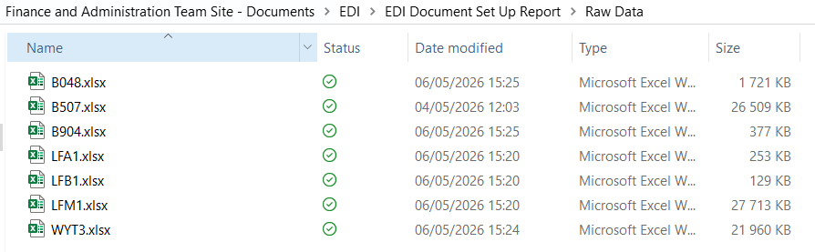
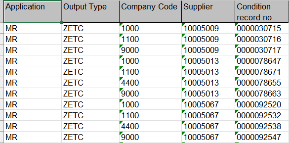

# Data Extraction & Validation Tool

## Overview
This project automates the extraction and validation of data required for Power Query reporting, ensuring consistency and correctness in reporting inputs.

## Business Problem
Data required for reporting was manually extracted from multiple sources, increasing the risk of incorrect file selection, inconsistent filters, and misplaced files.

## Solution
Developed a Python automation tool that:
- Extracts data using predefined filters
- Validates file outputs
- Ensures files are saved to the correct directory structure

## Features
- Automated data extraction
- Built-in validation checks
- Controlled file output locations
- Prevention of incorrect file usage

## Example Impact
- Reduced risk of reporting errors
- Improved consistency in Power Query inputs
- Eliminated manual file handling mistakes

## Tech Stack
- Python
- File system automation
- Data validation logic

## Notes
All data sources and file paths have been anonymized.

## Data Export

The automation generates structured output files that are used as inputs for reporting workflows.

### Exported Files
Below is an example of the files automatically generated and saved to the correct directory:

### Sample Data
Example of the raw data extracted and saved into Excel:

