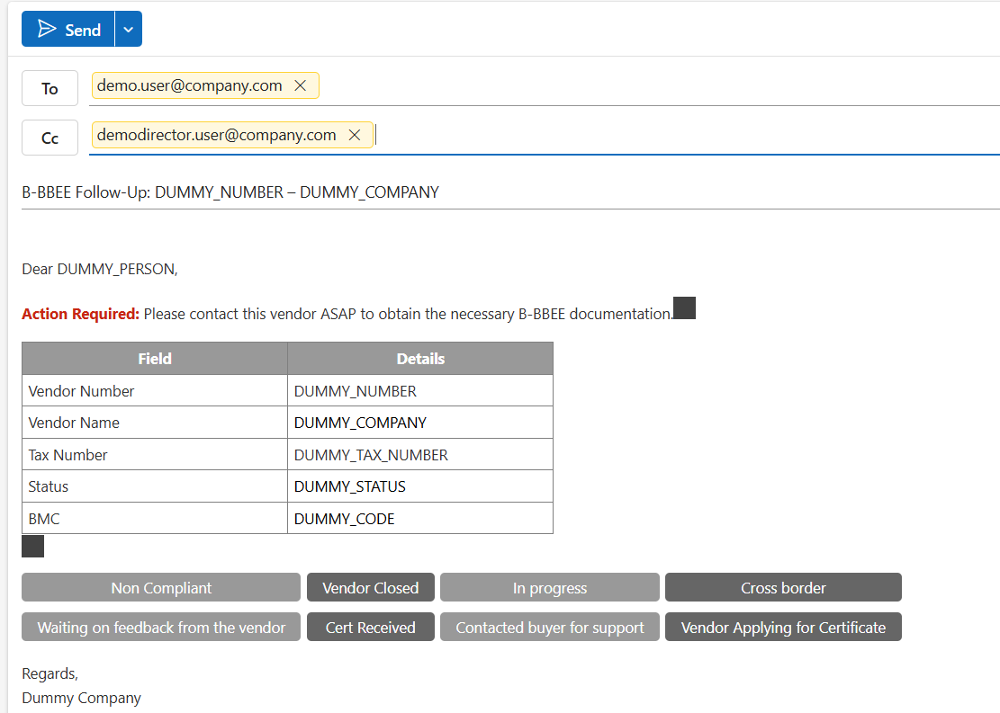
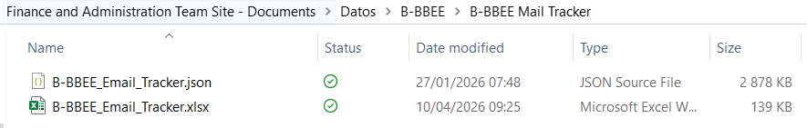
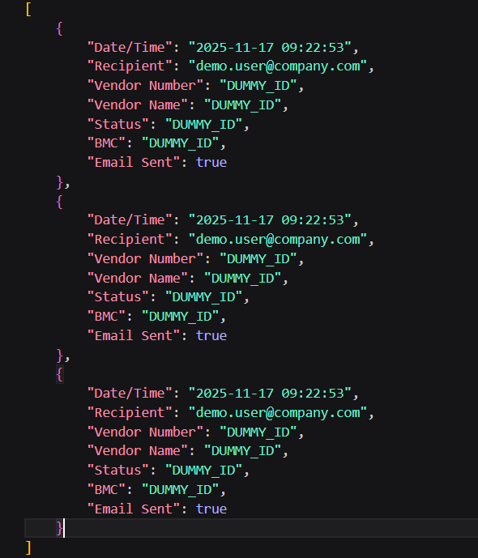

# Email Automation & Response Tracking System

## Overview
This project automates large-scale email communication and tracks recipient responses, providing visibility into engagement and improving operational efficiency.

## Business Problem
Manual email distribution required sending over 1000 vendor-specific emails to more than 30 recipients. This process was time-intensive, inconsistent, and difficult to track.

## Solution
Developed an automated system that:
- Sends emails based on a predefined mapping of recipients and vendors
- Maintains consistent subject lines for tracking purposes
- Tracks responses through embedded actions (buttons)

## Features
- Bulk email automation
- Dynamic recipient and vendor mapping
- Standardized subject line generation
- Response tracking based on user interaction

## Example Impact
- Reduced time required from a full day to automated execution
- Improved tracking of engagement and response rates
- Increased consistency and accuracy in communication

## Tech Stack
- Python
- Automation scripts
- Email integration

## Notes
All email data and identifiers have been anonymized.

## Email Automation Output

### Email Body Example
Below is an example of the automated email body generated and sent to recipients:

### Email Tracking Output
This view shows how responses are tracked based on user interaction and subject line identification:

### JSON Data Example
The system uses structured JSON data to manage email configurations and tracking logic:

