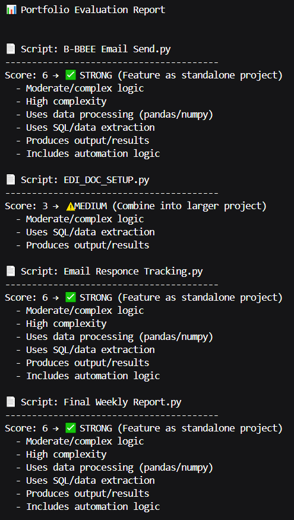
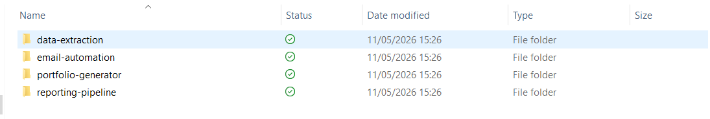
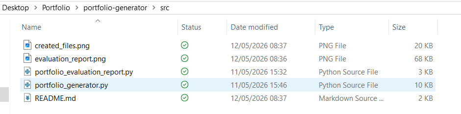

# Portfolio Automation & Evaluation Tool

## Overview
This project automates the evaluation and presentation of Python projects, helping identify high-value portfolio content and display it in a structured, user-friendly format.

## Business Problem
Determining which scripts to include in a professional portfolio required manual review, making it difficult to objectively assess project value and presentation.

## Solution
Developed an automated tool that:
- Evaluates scripts based on predefined scoring criteria
- Identifies high-impact projects
- Generates an interactive HTML view for portfolio visualization

## Features
- Script scoring and classification
- Portfolio recommendation system
- HTML-based interactive portfolio display
- Clean and structured project overview

## Example Impact
- Streamlined portfolio creation process
- Improved presentation of technical work
- Enabled consistent evaluation of project quality

## Tech Stack
- Python
- HTML generation
- Automation logic

## Notes
All project references have been adapted for demonstration purposes.

## Portfolio Evaluation Output

This system automates the evaluation and generation of a structured project portfolio, improving consistency and reducing manual effort in presenting technical work.

### Evaluation Report
Below is an example of the automated evaluation report used to score and classify projects:

---

## Portfolio Generator Output

### Generated Project Files
Example of the files created when building the portfolio:

### File Structure Overview
Breakdown of how projects are organized into a structured portfolio layout:

