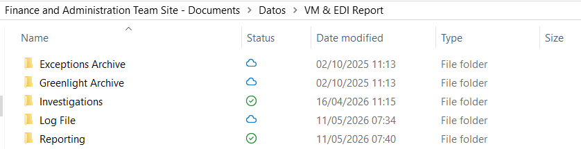
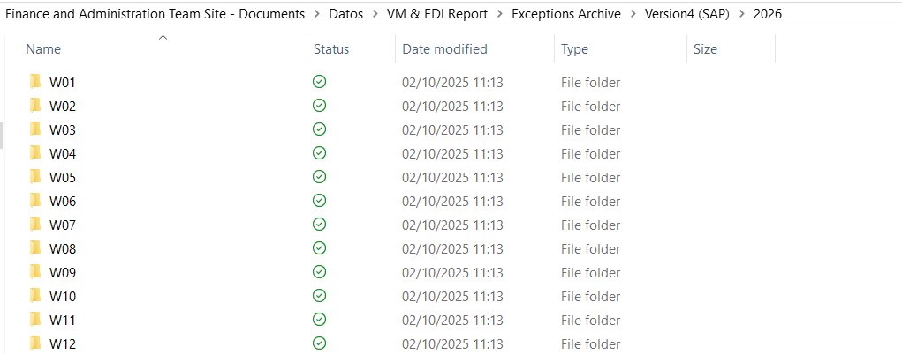
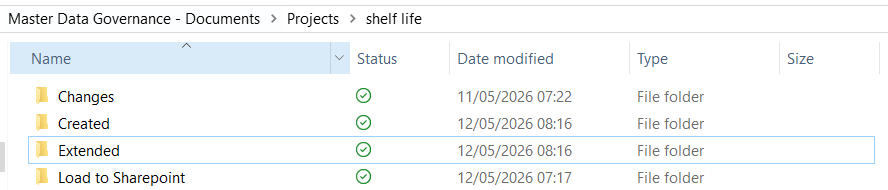
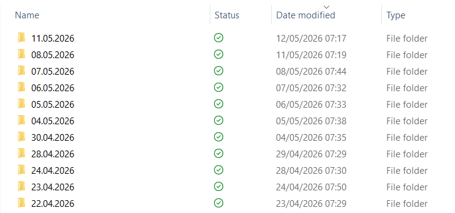
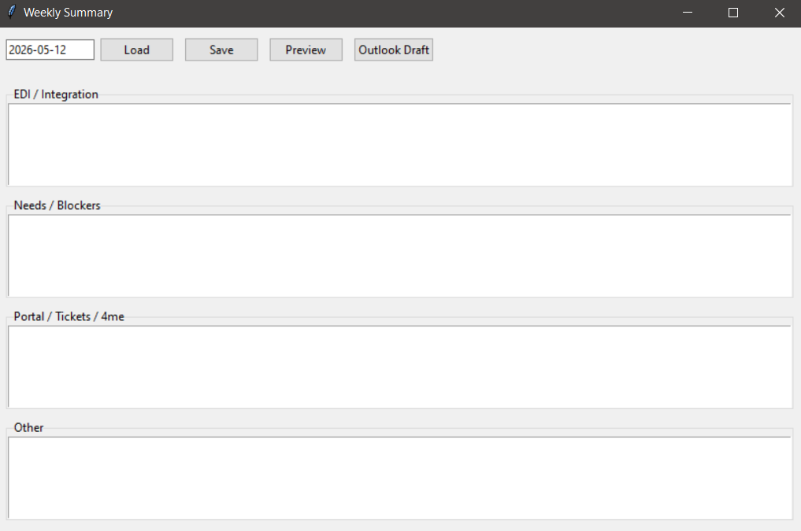

# Automated Reporting Pipeline

## Overview
This project automates the generation of multiple business-critical reports by consolidating data from SAP and other sources. It replaces highly manual processes that previously required navigating multiple systems and extracting data across several tables.

## Business Problem
Key reports (e.g. EDI performance, product lifecycle tracking, weekly summaries) required manual extraction from multiple SAP transactions and systems, which was time-consuming, error-prone, and inefficient.

## Solution
Developed a Python-based automation pipeline that:
- Extracts and consolidates data from multiple sources
- Cleans and transforms datasets using Pandas
- Generates structured Excel reports for business use
- Highlights key metrics and anomalies (e.g. identifying high-risk values)

## Features
- Automated SAP data extraction workflows
- Data transformation and formatting
- Report generation with key business insights
- Weekly summary automation with user input capture

## Example Impact
- Reduced manual reporting effort significantly
- Improved data accuracy and consistency
- Enabled faster identification of operational issues (e.g. invoice failures, product shelf-life risks)

## Tech Stack
- Python
- Pandas
- SQL / SAP data extraction

## Notes
All data and system references have been anonymized for portfolio purposes.

## Reporting Pipeline Output

This pipeline automates the extraction and transformation of business data into structured outputs used for reporting and analysis.

### Weekly Report Output
Below is an example of the weekly report generated automatically from multiple data sources:

### Weekly Breakdown
Detailed view of the processed data showing key metrics and breakdowns:

---

### SLED Report Output
Example of the SLED report identifying recently created or extended articles and highlighting key attributes:

### SLED Breakdown
Detailed breakdown used to identify potential issues such as incorrect shelf-life values:

---

### Weekly Summary Input
User input interface used to capture weekly activity summaries, which are compiled into a structured report:

